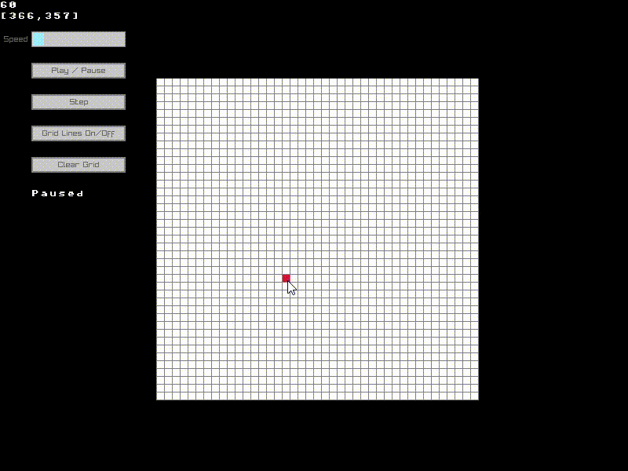

# 🌱 Conway's Game of Life

Conway's Game of Life implementation with raylib and c++. Windows and Ubuntu builds.



## ✔️ Requirements

* [Raylib 3.7.0](https://github.com/raysan5/raylib)
* g++
* make
* mingw 64bits (Windows)

## Installation

* Ubuntu packages
```bash
sudo apt install g++ build-essential libasound2-dev mesa-common-dev libx11-dev libxrandr-dev libxi-dev xorg-dev libgl1-mesa-dev libglu1-mesa-dev
```
All raylib binaries and header files are in "lib/" folder

## ⌨️ Getting Started (Ubuntu bash)

* Build binaries
```bash
 make
```

* Run
```bash
 make run
```
* Delete binaries
```bash
 make clean
```

## ⌨️ Getting Started (Windows powershell)

* Build binaries
```bash
 mingw32-make -f makefile.win
```
* Run
```bash
 mingw32-make -f makefile.win run
```
* Delete binaries
```bash
 mingw32-make -f makefile.win clean
```

## 👨‍💻 Maintainers/Contributors

* [David Costa](mailto:davidshcosta@gmail.com)

## 📝 License

This project is licensed under the MIT GENERAL PUBLIC LICENSE - see the [LICENSE](LICENSE) file for more details.

**Open Source Software** Hell Yeah!!! ヽ(・∀・)ﾉ